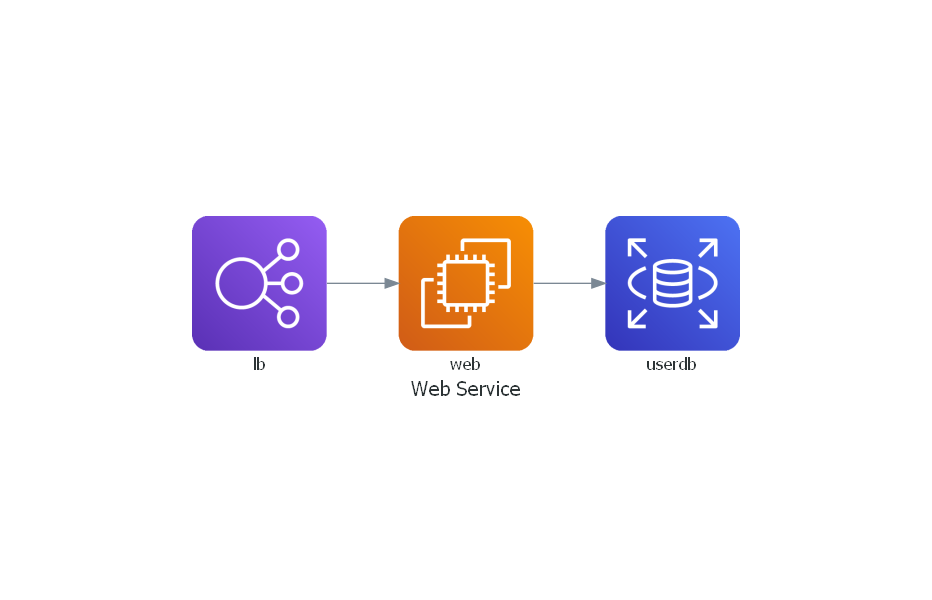

# **Mkdocs!** tests rules!!!
```
Opa, tudo bem? Isso é um teste!
```
# *Let´s Rock!*

MkDocs comes with a built-in dev-server that lets you preview your documentation as you work on it. Make sure you're in the same directory as the **mkdocs.yml** configuration file, and then start the server by running the mkdocs serve command:

----
**Basic Network ...**
----
* Assunto 1

MkDocs comes with a built-in dev-server that lets you preview your documentation as you work on it. Make sure you're in the same directory as the mkdocs.yml configuration file, and then start the server by running the mkdocs serve command:

* Assunto 2

MkDocs comes with a built-in dev-server that lets you preview your documentation as you work on it. Make sure you're in the same directory as the mkdocs.yml configuration file, and then start the server by running the mkdocs serve command:

* Assunto 3

```
MkDocs comes with a built-in dev-server that lets you preview your documentation as you work on it. Make sure you're in the same directory as the mkdocs.yml configuration file, and then start the server by running the mkdocs serve command:
```
----

***Alguns comandos***
```ifconfig / curl / ls / ls -ltr / cd / tailf / grep / etc```

----

# Esquema 1
----



----
# Exemplo (Diagrama)
----
## Azure 

